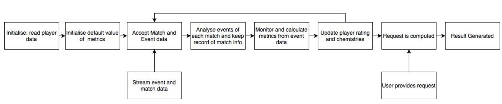

# English Premier League (EPL) Match Analytics with Spark and HDFS

## Overview

This system performs real-time analysis of English Premier League (EPL) football matches by processing live match data through Apache Spark Streaming. The system calculates player ratings, team chemistry, and predicts match outcomes using advanced analytics and machine learning techniques.

### Key Features

- Real-time event processing using Spark Streaming
- Player performance metrics calculation
- Team chemistry analysis
- Match outcome prediction
- Player clustering and rating regression
- RESTful API for data queries

## System Architecture

The system is built on the following components:

- **Apache Spark**: Core processing engine
- **Spark Streaming**: Real-time data ingestion
- **Spark MLlib**: Machine learning operations
- **Python**: Primary programming language
- **Socket Programming**: Data streaming



## Data Structure

### Input Data Sources

1. **Static Data Files**:
   - players.csv: Initial player information
   - teams.csv: Team information

2. **Streamed Data**:
   - Match JSON objects
   - Event JSON objects

### JSON Structures

#### Match JSON
```json
{
  "competitionId": "integer",
  "date": "string",
  "dateutc": "YYYY-MM-DD hh:mm:ss",
  "duration": "Regular|ExtraTime|Penalties",
  "gameweek": "integer",
  "roundID": "integer",
  "seasonId": "integer",
  "status": "Played|Cancelled|Postponed|Suspended",
  "venue": "string",
  "winner": "integer",
  "wyId": "integer",
  "teamsData": {
    "teamId": "the identifier of the team",
    "side": "the team side in the match (it can be 'home' or 'away')",
    "score": "the number of goals scored by the team during the match (not counting penalties)",
    "scoreHT": "the number of goals scored by the team during the first half of the match",
    "scoreET": "the number of goals scored by the team during the match, including the extra time (not counting penalties)",
    "scoreP": "the total number of goals scored by the team after the penalties",
    "coachId": "the identifier of the team's coach",
    "hasFormation": "it has value 0 if no formation (lineups and benches) is present, and 1 otherwise",
    "bench": "the list of the team's players that started the match in the bench and some basic statistics about their performance during the match (goals, own goals, cards)",
    "lineup": "the list of the team's players in the starting lineup and some basic statistics about their performance during the match (goals, own goals, cards)",
    "substitutions": "the list of team's substitutions during the match, describing the players involved and the minute of the substitution",
  }
}
```

#### Event JSON

```json
{
  "eventId": "the identifier of the event's type. Each eventId is associated with an event name",
  "eventName": "name of the event's type. There are seven types of events: pass, foul, shot, duel, free kick, offside and touch",
  "subEventId": "the identifier of the subevent's type. Each subEventId is associated with a subevent name",
  "subEventName": "the name of the subevent's type. Each event type is associated with a different set of subevent types",
  "tags": "a list of event tags, each one describes additional information about the event. Each event type is associated with a different set of tags",
  "eventSec": "the time when the event occurs (in seconds since the beginning of the current half of the match)",
  "id": "a unique identifier of the event",
  "matchId": "the identifier of the match the event refers to",
  "matchPeriod": "the period of the match. It can be '1H' (first half of the match), '2H' (second half of the match), 'E1' (first extra time), 'E2' (second extra time) or 'P' (penalties time)",
  "playerId": "the identifier of the player who generated the event",
  "positions": "the origin and destination positions associated with the event",
  "teamId": "the identifier of the player's team"
}
```

## Player Metrics

The system calculates the following metrics in real-time:

### 1. Pass Accuracy
- **Event ID**: 8
- **Formula**: (accurate_normal_passes + accurate_key_passes * 2) / (total_normal_passes + key_passes * 2)
- **Tags**:
  - 1801: Accurate pass
  - 1802: Inaccurate pass
  - 302: Key pass

### 2. Duel Effectiveness
- **Event ID**: 1
- **Formula**: (duels_won + neutral_duels * 0.5) / total_duels
- **Tags**:
  - 701: Lost duel
  - 702: Neutral duel
  - 703: Won duel

### 3. Free Kick Effectiveness
- **Event ID**: 3
- **Formula**: (effective_free_kicks + penalties_scored) / total_free_kicks
- **Special Case**: SubEventId 35 for penalties

### 4. Shots on Target
- **Event ID**: 10
- **Formula**: (shots_on_target_and_goals + shots_on_target_no_goals * 0.5) / total_shots
- **Tags**:
  - 1801: Shot on target
  - 1802: Shot off target
  - 101: Goal

### 5. Additional Metrics
- Foul Count (Event ID: 2)
- Own Goals (Tag ID: 102)

## Player Analysis

### Player Contribution
Player Contribution = (pass_accuracy + duel_effectiveness + free_kick_effectiveness + shots_on_target) / 4


#### Playing Time Normalization
- Full match players: × 1.05
- Substituted players: × (minutes_played / 90)
- Bench players: 0

### Player Performance
- Base: Player Contribution
- Penalties:
  - -0.5% per foul
  - -5% per own goal

### Player Rating
Player Rating = (player_performance + existing_player_rating) / 2


## Team Chemistry

### Chemistry Calculation
- Initial value: 0.5 between all pairs
- Updated after each match based on rating changes
- Formula varies for same-team vs opposing-team players

#### Same Team
- Both ratings increase/decrease: Chemistry increases
- Mixed rating changes: Chemistry decreases

#### Opposing Teams
- Both ratings increase/decrease: Chemistry decreases
- Mixed rating changes: Chemistry increases

## Machine Learning Components

### Player Clustering
- 5 clusters based on player profiles
- Used for players with <5 matches
- Considers multiple player attributes

### Rating Regression
- Quadratic regression model
- Predicts rating changes based on age
- Used for future match predictions

## User Interface Tasks

### 1. Match Prediction

Request

```json
{
    "req_type": 1,
    "date": "YYYY-MM-DD",
    "team1": {
        "name": "string",
        "player1": "string",
        "..."
        "player11": "string",
    },
    "team2": {
        "name": "string",
        "player1": "string",
        "..."
        "player11": "string",
    }
}
```

Response

```json
{
    "team1": {
        "name": "string",
        "winning_chance": "integer"
    },
    "team2": {
        "name": "string",
        "winning_chance": "integer"
    }
}
```


### 2. Player Profile

Request

```json
{
    "req_type": 2,
    "name": "string"
}
```

Response

```json
{
    "name": "string",
    "birthArea": "string",
    "birthDate": "string",
    "foot": "string",
    "role": "string",
    "height": "integer",
    "passportArea": "string",
    "weight": "integer",
    "fouls": "integer",
    "goals": "integer",
    "own_goals": "integer",
    "percent_pass_accuracy": "integer",
    "percent_shots_on_target": "integer"
}
```


### 3. Match Information

Request


```json
{
    "date": "YYYY-MM-DD",
    "label": "string"
}
```

Response

```json
{
    "date": "YYYY-MM-DD",
    "duration": "string",
    "winner": "string",
    "venue": "string",
    "gameweek": "integer",
    "goals": [
        {
            "name": "string",
            "team": "string",
            "number_of_goals": "integer"
        }
    ],
    "own_goals": [
        {
            "name": "string",
            "team": "string",
            "number_of_goals": "integer"
        }
    ],
    "yellow_cards": ["string"],
    "red_cards": ["string"]
}
```


## Team Composition Rules

- 1 Goalkeeper (GK)
- Minimum 3 Defenders (DF)
- Minimum 2 Midfielders (MD)
- Minimum 1 Forward (FW)
